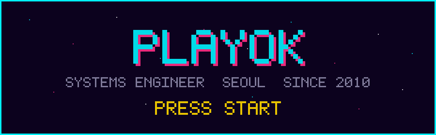
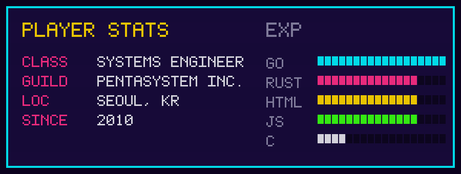
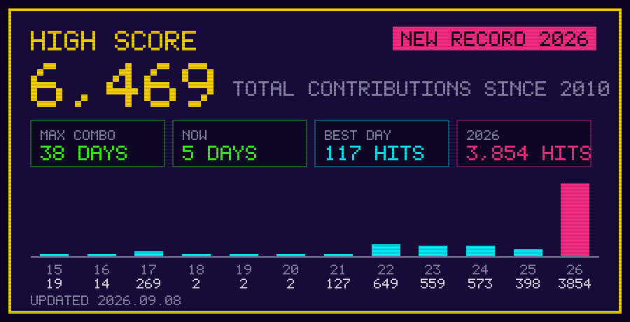

## INVENTORY

### WORLD 1 — SERVER OPS

| 아이템 | 설명 | 언어 |
|---|---|---|
| [jvm-oom-guardian](https://github.com/playok/jvm-oom-guardian) | JVM OutOfMemoryError를 감지해 Tomcat을 재기동하는 감시자 | Go |
| [TomcatKit](https://github.com/playok/TomcatKit) | Tomcat 9 설정 파일을 다루는 터미널 UI 유틸리티 | Go |
| [only1mon](https://github.com/playok/only1mon) | 장비 한 대만 집중 감시하는 경량 모니터 | Go |
| [pg19-simd-check](https://github.com/playok/pg19-simd-check) | PostgreSQL 19의 SIMD 지원 여부 판별기 | C |

### WORLD 2 — DESKTOP TOOLS

| 아이템 | 설명 | 언어 |
|---|---|---|
| [devup](https://github.com/playok/devup) | 개발 도구 버전을 점검하고 갱신하는 윈도우 데스크톱 앱 | Rust |
| [DevHome_Relocator](https://github.com/playok/DevHome_Relocator) | 개발 도구 캐시를 시스템 드라이브 밖으로 옮기는 GUI 도구 | Rust |
| [synergy-hangul-fix](https://github.com/playok/synergy-hangul-fix) | Synergy/Deskflow 사용 시 한영 전환이 깨지는 문제 해결 | Rust |

### WORLD 3 — WEB & DATA

| 아이템 | 설명 | 언어 |
|---|---|---|
| [gitNotepad](https://github.com/playok/gitNotepad) | git을 저장소로 쓰는 웹 메모장 ★3 | JavaScript |
| [ParquetDuckQuery](https://github.com/playok/ParquetDuckQuery) | DuckDB JDBC로 Parquet을 조회하는 도구 | HTML |
| [packetDup](https://github.com/playok/packetDup) | 트래픽을 복제해 흘려보내는 패킷 프록시 | HTML |
| [kr-supercharger-timeline](https://github.com/playok/kr-supercharger-timeline) | 국내 슈퍼차저 설치 이력 타임라인 | HTML |

### WORLD 4 — AI & SIGNAL

| 아이템 | 설명 | 언어 |
|---|---|---|
| [mcp-glm-go](https://github.com/playok/mcp-glm-go) | Z.AI GLM 모델을 연결하는 MCP 서버 | Go |
| [audio-modem](https://github.com/playok/audio-modem) | 스피커와 마이크만으로 파일을 전송하는 OFDM 오디오 모뎀 | JavaScript |

## CURRENT QUEST

- 오래 돌아가는 서버가 조용히 죽지 않게 만드는 도구
- JVM · Tomcat · PostgreSQL 운영 자동화
- Rust로 데스크톱 유틸리티 옮기기

## CONTACT

- 홈페이지 — [playok.github.io](https://playok.github.io)
- 블로그 — [sarangsai.com](http://www.sarangsai.com)

하이스코어는 매일 자동 갱신됩니다. 위 SVG는 전부 <code>scripts/</code>의 파이썬 생성기가 5×7 비트맵 폰트로 그립니다 — 외부 서비스에 의존하지 않습니다.

<!-- profile readme -->
